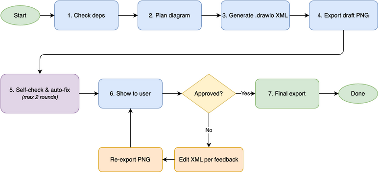
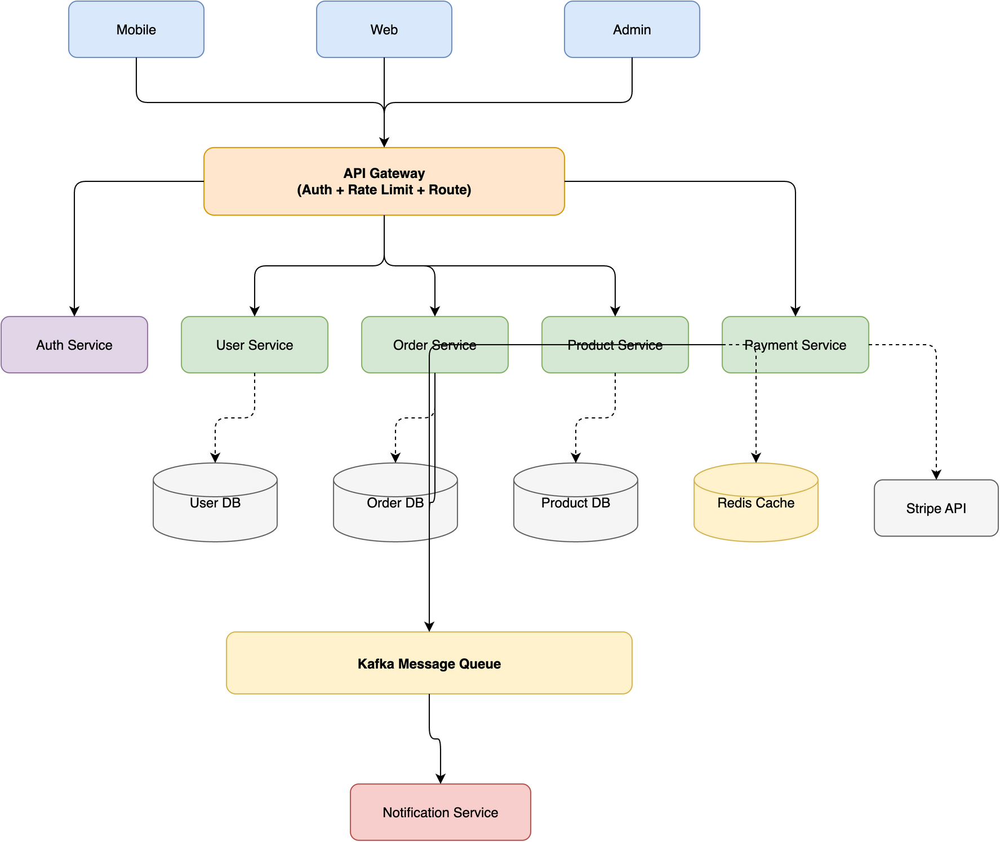
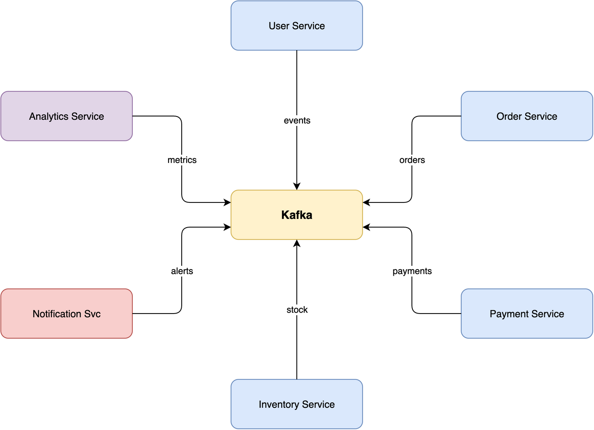
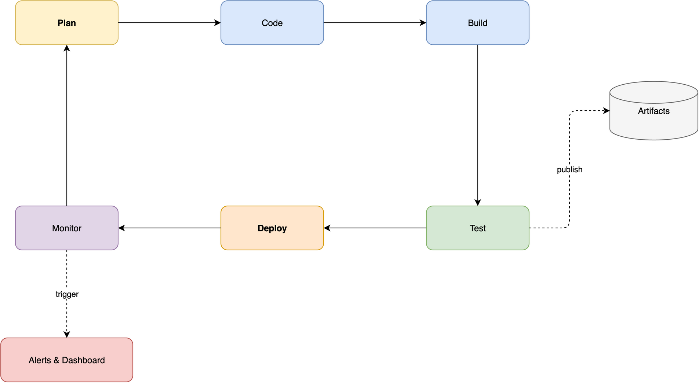

# drawio-skill — From Text to Professional Diagrams

[中文文档](README_CN.md)

## What it does

- Generates `.drawio` XML files from natural language descriptions
- Exports diagrams to PNG, SVG, PDF, or JPG using the native draw.io desktop CLI
- Supports multi-page diagrams and layered grouping
- Iterative design: preview, get feedback, and refine diagrams until they look right
- Triggers automatically when diagrams would help explain complex systems

## Multi-Platform Support

Works with all major AI coding agents that support the [Agent Skills](https://agentskills.io) format:

| Platform | Status | Details |
|----------|--------|---------|
| **Claude Code** | ✅ Full support | Native SKILL.md format |
| **OpenClaw** | ✅ Full support | `metadata.openclaw` namespace, dependency gating, installer |
| **Hermes Agent** | ✅ Full support | `metadata.hermes` namespace, tags, tool gating |
| **OpenAI Codex** | ✅ Full support | `agents/openai.yaml` sidecar file |
| **SkillsMP** | ✅ Indexed | GitHub topics configured |

## Comparison

### vs No Skill (native agent)

| Feature | Native agent | This skill |
|---------|-------------|------------|
| Generate draw.io XML | Yes — LLMs know the format | Yes |
| Self-check after export | No | Yes — reads PNG and auto-fixes 6 issue types |
| Iterative review loop | No — must manually re-prompt | Yes — targeted edits, 5-round safety valve |
| Proactive triggers | No — only when explicitly asked | Yes — auto-suggests when 3+ components |
| Layout guidelines | None — varies by run | Complexity-scaled spacing, routing corridors, hub placement |
| Color palette | Random/inconsistent | 7-color semantic system (blue=services, green=DB, purple=auth...) |
| Edge routing rules | Basic | Pin entry/exit points, distribute connections, waypoint corridors |
| Container/group patterns | None | Swimlane, group, custom container with parent-child nesting |
| Embed diagram in export | No | Yes — `--embed-diagram` keeps exported PNG/SVG/PDF editable |
| Chinese language triggers | No | Yes — "画图", "架构图", "流程图" |

### vs Other draw.io Skills & Tools

| Feature | This skill | [jgraph/drawio-mcp](https://github.com/jgraph/drawio-mcp) (official, 1.3k⭐) | [bahayonghang/drawio-skills](https://github.com/bahayonghang/drawio-skills) (60⭐) | [GBSOSS/ai-drawio](https://github.com/GBSOSS/ai-drawio) (63⭐) |
|---------|-----------|---------------|-------------------|--------------|
| **Approach** | Pure SKILL.md | SKILL.md / MCP / Project | YAML DSL + MCP | Plugin + browser |
| **Dependencies** | draw.io desktop only | draw.io desktop | MCP server (`npx`) | Browser + local server |
| **Multi-agent** | ✅ 5 platforms | ❌ Claude Code only | ❌ Claude Code only | ❌ |
| **Self-check** | ✅ 2-round auto-fix | ❌ | ❌ | ❌ screenshot |
| **Iterative review** | ✅ 5-round loop | ❌ generate once | ✅ 3 workflows | ❌ |
| **Layout guidance** | ✅ complexity-scaled | ✅ basic spacing | ❌ relies on MCP | ❌ |
| **Color system** | ✅ 7-color semantic | ❌ | ✅ 5 themes | ❌ |
| **Container/group** | ✅ swimlane + group | ✅ detailed | ❌ | ❌ |
| **Embed diagram** | ✅ `--embed-diagram` | ✅ | ❌ | ❌ |
| **Edge routing** | ✅ corridors + waypoints | ✅ arrowhead rules | ❌ | ❌ |
| **Chinese support** | ✅ triggers + docs | ❌ | ❌ | ✅ |
| **Cloud icons** | AWS basic | ❌ | ✅ AWS/GCP/Azure/K8s | ❌ |
| **Zero-config** | ✅ copy SKILL.md | ✅ | ❌ needs `npx` | ❌ needs plugin install |

### Key advantages

1. **Self-check + iterative loop** — the only pure-SKILL.md solution that reads its own output and auto-fixes before showing the user, then supports multi-round refinement
2. **Multi-agent, zero-config** — works across 5 platforms with just one `SKILL.md` file + draw.io desktop. No MCP server, no Python, no Node.js, no browser
3. **Production-grade layout** — complexity-scaled spacing, routing corridors, hub-center strategy, connection distribution rules
4. **Full Chinese support** — proactive triggers ("画图", "架构图"), bilingual documentation

## Supported diagram types

- **Architecture**: microservices, cloud (AWS/GCP/Azure), network topology, deployment
- **Flowcharts**: business processes, workflows, decision trees, state machines
- **UML**: class diagrams, sequence diagrams, use case diagrams
- **Data**: ER diagrams, data flow diagrams (DFD)
- **Other**: org charts, mind maps, wireframes

## How it works

<p align="center">
  
</p>

## Prerequisites

The draw.io desktop app must be installed for diagram export:

### macOS

```bash
# Recommended — Homebrew
brew install --cask drawio

# Verify
drawio --version
```

### Windows

Download and install from: https://github.com/jgraph/drawio-desktop/releases

```powershell
# Verify
"C:\Program Files\draw.io\draw.io.exe" --version
```

### Linux

Download `.deb` or `.rpm` from: https://github.com/jgraph/drawio-desktop/releases

```bash
# Headless export (required on Linux servers without display)
sudo apt install xvfb  # Debian/Ubuntu
xvfb-run -a drawio --version
```

| Platform | Extra step |
|----------|------------|
| **macOS** | No extra steps after Homebrew install |
| **Windows** | Use full path if not in PATH |
| **Linux** | Wrap commands with `xvfb-run -a` for headless export |

## Skill Installation

### Claude Code

```bash
# Global install (available in all projects)
git clone https://github.com/Agents365-ai/drawio-skill.git ~/.claude/skills/drawio

# Project-level install
git clone https://github.com/Agents365-ai/drawio-skill.git .claude/skills/drawio
```

### OpenClaw

```bash
# Via ClawHub
clawhub install drawio

# Manual install
git clone https://github.com/Agents365-ai/drawio-skill.git ~/.openclaw/skills/drawio

# Project-level install
git clone https://github.com/Agents365-ai/drawio-skill.git skills/drawio
```

### Hermes Agent

```bash
# Install under design category
git clone https://github.com/Agents365-ai/drawio-skill.git ~/.hermes/skills/design/drawio
```

Or add an external directory in `~/.hermes/config.yaml`:

```yaml
skills:
  external_dirs:
    - ~/myskills/drawio-skill
```

### OpenAI Codex

```bash
# User-level install
git clone https://github.com/Agents365-ai/drawio-skill.git ~/.agents/skills/drawio

# Project-level install
git clone https://github.com/Agents365-ai/drawio-skill.git .agents/skills/drawio
```

### SkillsMP

Search for `drawio` on [skillsmp.com](https://skillsmp.com) or use the CLI:

```bash
skills install drawio
```

### Installation paths summary

| Platform | Global path | Project path |
|----------|-------------|--------------|
| Claude Code | `~/.claude/skills/drawio/` | `.claude/skills/drawio/` |
| OpenClaw | `~/.openclaw/skills/drawio/` | `skills/drawio/` |
| Hermes Agent | `~/.hermes/skills/design/drawio/` | Via `external_dirs` config |
| OpenAI Codex | `~/.agents/skills/drawio/` | `.agents/skills/drawio/` |
| SkillsMP | N/A (installed via CLI) | N/A |

## Usage

Just describe what you want:

```
Create a microservices e-commerce architecture with API Gateway, auth/user/order/product/payment services,
Kafka message queue, notification service, and separate databases for each service
```

The agent will generate the `.drawio` XML file and export it to PNG automatically.

## Example

**Prompt:**
> Create a microservices e-commerce architecture with Mobile/Web/Admin clients, API Gateway,
> Auth/User/Order/Product/Payment services, Kafka message queue, Notification service,
> and User DB / Order DB / Product DB / Redis Cache / Stripe API

**Output:**



## Topology demos

The skill handles various diagram topologies with clean edge routing — no lines crossing through shapes.

### Star topology (7 nodes)

Central message broker with 6 microservices radiating outward. Edges enter Kafka from different sides, zero crossings.



### Layered flow (10 nodes, 4 tiers)

E-commerce architecture with 2 cross-connections: Order→Product (same-tier horizontal) and Auth→Redis (diagonal via routing corridor). All edges route cleanly.


### Ring / cycle (8 nodes)

CI/CD pipeline with a closed loop and 2 spur branches. Edges flow along the perimeter without crossing the interior.



## Files

- `SKILL.md` — **the only required file**. Loaded by all platforms as the skill instructions.
- `agents/openai.yaml` — OpenAI Codex-specific configuration (UI, policy)
- `README.md` — this file (English, displayed on GitHub homepage)
- `README_CN.md` — Chinese documentation
- `assets/` — example diagrams and workflow images

> **Note:** Only `SKILL.md` is needed for the skill to work. `agents/openai.yaml` is only needed for Codex. The `assets/` and README files are documentation only and can be safely deleted to save space.

> All example diagrams were generated by Claude Opus 4.6 with this skill.

## License

MIT

## Support

If this skill helps you, consider supporting the author:

<table>
  <tr>
    <td align="center">
      
      <br>
      <b>WeChat Pay</b>
    </td>
    <td align="center">
      
      <br>
      <b>Alipay</b>
    </td>
    <td align="center">
      
      <br>
      <b>Buy Me a Coffee</b>
    </td>
  </tr>
</table>

## Author

**Agents365-ai**

- Bilibili: https://space.bilibili.com/441831884
- GitHub: https://github.com/Agents365-ai
